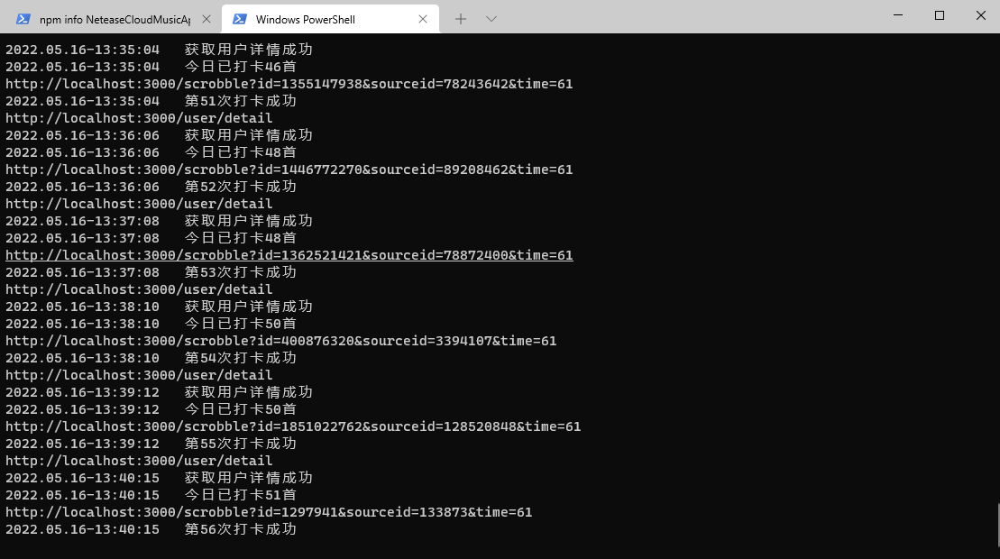
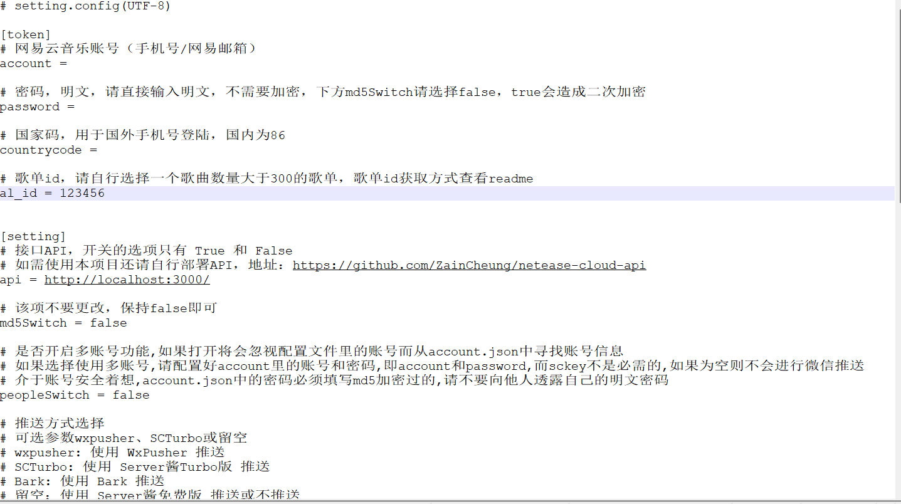

## 网易云音乐自动听歌打卡，直冲LV10

​	本项目基于[GayHub上的项目](https://github.com/ZainCheung/netease-cloud)，在此感谢原作者的付出，因为本人下载后发现不能正常使用，因此在原作上基础上修改了部分BUG，适配了网易云的最新API，使打卡功能可正常使用。

## 项目主要文件说明

account.json   开启多账号功能，此处存放多个账号信息

init.config   项目配置文件，使用时必须填写配置文件相关参数

main.py	项目主文件

requirements.txt	项目依赖库

run.log	项目日志文件

## 使用方法

**使用前必须先部署[NeteaseCloudMusicApi](https://github.com/Binaryify/NeteaseCloudMusicApi),部署完成后将部署地址填入init.config文件中的api字段内。**

`pip install -r requirements.txt  #完成项目依赖安装`  **运行过程中若提示缺少依赖，请自行安装**

打开init.config文件填写自己的账号密码。**注意：密码明文即可，不要加密，md5Switch保持false不要更改**

打开网易云音乐选择一个歌曲数量大于300首的歌单（网易API规定每天打卡上限为300首，所以程序到300首后会自动停止），歌单id获取方法为：选择歌单以链接的形式分享，链接中id=后的一串数字即为歌单id

`python main.py #运行程序`

## 说明&截图

**本项目仅供学习交流使用，若发现BUG或有新的需求请提issues，我看到后会及时处理，若感觉本项目对您有帮助请给一颗star，谢谢。**

##Github Action参数说明
# 网易云音乐账号（手机号）
ACCOUNT

# 密码，明文，请直接输入明文，不需要加密，下方md5Switch请选择false，true会造成二次加密
PASSWORD

# 国家码，用于国外手机号登陆，国内为86
COUNTRYCODE

# 歌单id，请自行选择一个歌曲数量大于300的歌单，歌单id获取方式查看readme
ALID

[setting]
# 接口API，开关的选项只有 True 和 False
# 如需使用本项目还请自行部署API，地址：https://github.com/ZainCheung/netease-cloud-api
API

# 该项不要更改，保持false即可
MD5SWITCH

# 是否开启多账号功能,如果打开将会忽视配置文件里的账号而从account.json中寻找账号信息
# 如果选择使用多账号,请配置好account里的账号和密码,即account和password,而sckey不是必需的,如果为空则不会进行微信推送
# 介于账号安全着想,account.json中的密码必须填写md5加密过的,请不要向他人透露自己的明文密码
PEOPLESWITCH

# 推送方式选择
# 可选参数wxpusher、SCTurbo或留空
# wxpusher: 使用 WxPusher 推送
# SCTurbo: 使用 Server酱Turbo版 推送
# Bark: 使用 Bark 推送
# pushplus: 使用 PushPlus 推送
# 留空：使用 Server酱免费版 推送或不推送
PUSHMETHOD

# Server酱的密匙,不需要推送就留空
# 免费版密匙的免费申请参考:http://sc.ftqq.com/
# Turbo版的密钥获取:https://sct.ftqq.com/sendkey
# 免费版和Turbo版的密钥长度不一样，请注意检查，不可混用
SCKEY

# PushPlus酱的密匙,不需要推送就留空
PPKEY

# Wxpusher 推送参数，需要将pushmethod指定为wxpusher，应用和uid的免费申请参考:https://wxpusher.zjiecode.com/
APPTOKEN
WXPUSHRUID

# Bark 推送参数, 请参考https://github.com/Finb/Bark, 公用默认服务器为https://api.day.app/
BARKSERVER
BARKKEY

